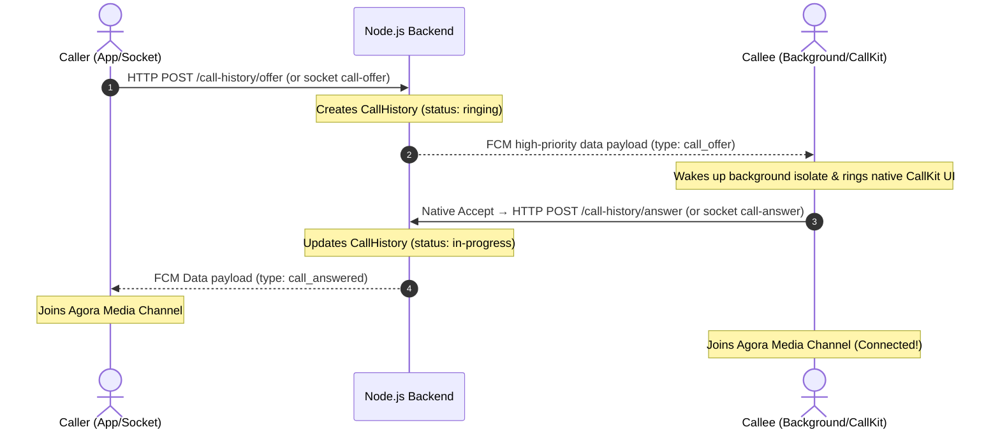

# Durrah Care — Voice Calls Architecture & Handoff Guide

> For the complete A→Z flow (all app states, iOS + Android, backend contracts, and scenario traces), see [voice-calls-complete-flow.md](./voice-calls-complete-flow.md).

> [!CAUTION]
> # CRITICAL DEVELOPER & AI AGENT WARNING
> **THE VOICE-CALLING WORKFLOW IN THIS APPLICATION IS HIGHLY DELICATE AND COALESCES NATIVE DEVICE SYSTEMS, OS BACKGROUND ISOLATES, FIREBASE CLOUD MESSAGING (FCM), SOCKET.IO, AND AGORA RTC MEDIA LAYERS.**
> 
> **DO NOT** modify, refactor, rewrite, or touch any calling-related files blindly. A single line change in states, navigation guards, or API endpoints can:
> 1. Cause silent **routing deadlocks** (blocking the call screen from opening).
> 2. Leave **stale records** in MongoDB, permanently blocking callers from making subsequent calls.
> 3. Leave the **Agora media engine active** in the background, draining battery and keeping the microphone open indefinitely.
> 4. Cause Callee devices to **ring indefinitely** or fail to connect audio.
> 
> *Read this architectural blueprint and understand every component before writing a single line of code!*

---

## 1. High-Level Blueprint

Voice calling is built on a **dual-layer model**:
1. **Signaling Layer (Socket.IO + REST Fallbacks + Firebase Cloud Messaging)**: Handles call offers, rings, accepts, declines, cancellations, and state synchronization. It uses REST fallbacks (HTTP APIs) extensively to recover when sockets are dead or in a "ghost" state (connected on client but evicted on server).
2. **Media Layer (Agora RTC Cloud)**: Handles the low-latency voice transmission. Once signaling joins the parties, both sides retrieve a temporary RTC token from the backend and connect to an Agora channel.



---

## 2. The Three Critical Resolved Bugs (And How Not to Break Them)

The entire calling subsystem was completely broken due to subtle deadlocks, background socket evictions, and stale database records. Below are the details of the three resolved bugs so you can avoid reintroducing them.

### Bug 1: Pilgrim Answers call but has No Caller ID / Screen (Double Deadlock)
* **The Root Cause**: A double-deadlock occurred when a Pilgrim accepted a call:
  1. **Dashboard Listeners Timing Gap**: The FCM notification transitioned the call state quickly: `ringing` $\rightarrow$ `connecting` $\rightarrow$ `connected`. The dashboards (`pilgrim_dashboard_screen.dart` and `moderator_dashboard_screen.dart`) only had a single listener looking for `ringing` $\rightarrow$ `connected` transitions, missing the intermediate `connecting` step entirely.
  2. **Navigation Self-Block Guard**: When native CallKit is clicked, `NativeCallCoordinator` sets `_navigatingToCall = true` to guard dashboard listeners from double-pushing screens. However, `openVoiceCallScreen()` was checking `isNavigatingToCall` and blocking itself because it saw the guard was active.
* **The Fix (DO NOT TOUCH)**:
  * We updated both dashboards to monitor all adjacent states (`ringing -> connecting` and `connecting -> connected`).
  * We introduced a `bypassNavigatingGuard` parameter inside `openVoiceCallScreen()` in [call_navigation.dart](file:///c:/Users/drago/Desktop/projects/Durrah%20care%20mob%20app/Flutter_Munawwara/lib/features/calling/call_navigation.dart) and passed `true` inside `NativeCallCoordinator._tryPushVoiceCall()` in [native_call_coordinator.dart](file:///c:/Users/drago/Desktop/projects/Durrah%20care%20mob%20app/Flutter_Munawwara/lib/features/calling/native_call_coordinator.dart). This allows the coordinator to bypass its own lock and successfully push the screen.

### Bug 2: Calling a Pilgrim a 3rd Time Fails to Connect (Stale Call Records)
* **The Root Cause**: If a call ended abruptly or socket connections dropped (battery saver, network changes), the MongoDB records remained stuck in `ringing` or `in-progress` states. When the client polled the server (`/call-history/check-active`) to verify if the caller was free, the backend would return `active: true` matching a stale, dead call session, permanently blocking any new calls from connecting.
* **The Fix (DO NOT TOUCH)**:
  * **Server-Side Auto-Expiry**: In [call_history_controller.js](file:///c:/Users/drago/Desktop/projects/Durrah%20care%20mob%20app/mc_backend_app/controllers/call_history_controller.js), the `check_call_active` API now automatically sweeps and expires any record stuck in `ringing` or `in-progress` that is older than 5 minutes:
    ```js
    const fiveMinutesAgo = new Date(Date.now() - 5 * 60 * 1000);
    await CallHistory.updateMany(
        { status: { $in: ['ringing', 'in-progress'] }, createdAt: { $lt: fiveMinutesAgo } },
        { status: 'ended' }
    );
    ```
  * **Strict Ring-Poll Filtering**: The client is now passed the specific database `callRecordId` inside [call_signaling.dart](file:///c:/Users/drago/Desktop/projects/Durrah%20care%20mob%20app/Flutter_Munawwara/lib/features/calling/call_signaling.dart) upon offering a call. The [call_provider.dart](file:///c:/Users/drago/Desktop/projects/Durrah%20care%20mob%20app/Flutter_Munawwara/lib/features/calling/providers/call_provider.dart) uses this exact `callRecordId` during periodic watchdog polling, preventing the client from matching and reacting to old, dead calling sessions.

### Bug 4: Device Stuck "In a Call" After Hang-Up (Orphaned Core-Telecom Call)
* **The Symptom**: After ending an incoming call, the device behaved as if a call was still active — volume buttons controlled the call stream, the OS blocked Airplane mode ("can't turn on flight mode while in a call"), and starting a real cellular call surfaced a ghost **"Munawwara Care" Answer/Decline** banner. The phantom call only cleared on a force-close of the app.
* **The Root Cause**: Two compounding native (Android) defects around the self-managed **Core-Telecom** call registered by [IncomingCallService](file:///c:/Users/drago/Desktop/projects/Durrah%20care%20mob%20app/Flutter_Munawwara/android/app/src/main/kotlin/com/munawwaracare/android/IncomingCallService.kt):
  1. **Duplicate incoming cancelled the registration.** Socket **and** FCM both ring, firing `ACTION_INCOMING_CALL` twice (~0.4s apart) for the same caller. The second `handleIncoming()` ran `tearDownCoreTelecomSession(cancelScopeAfterDisconnect = true)` first, **cancelling the first call's in-flight `CallsManager.addCall` coroutine before it captured `CallControlScope`** (`Core-Telecom error: x0 was cancelled`; `📞 Core-Telecom call registered successfully` never logged). The system call stayed registered with **no handle to disconnect it**.
  2. **Accept never released the call.** The plugin's `CallkitIncomingBroadcastReceiver` sent only `ACTION_DISMISS_FG_NOTIFICATION` on accept/connected — demoting the foreground service while leaving the Telecom call stuck *ringing*. `IncomingCallService.handleAccept()` (which would release it) was dead code. With the FGS demoted, Android could kill the service process, permanently orphaning the call; the hang-up path then restarted the service in a fresh process where `callControlScope == null`, so teardown was a no-op.
* **The Fix (DO NOT TOUCH)**:
  * **Idempotent `handleIncoming()`**: a duplicate `ACTION_INCOMING_CALL` for the same `currentCallerId` is ignored while still ringing/registering (`callJob?.isActive == true || callControlScope != null`), so the in-flight `addCall` coroutine completes and captures `CallControlScope`.
  * **Release on answer**: the plugin's `ACTION_CALL_ACCEPT` and `ACTION_CALL_CONNECTED` branches now send `ACTION_ACCEPT_CALL` to the service, and `handleAccept()` cleanly disconnects the Core-Telecom call (`DisconnectCause.LOCAL`) with `callWasAnswered`/`suppressDeclineHttpOnDisconnect` set so no spurious decline HTTP fires. The plugin's `CallkitNotificationService` (phoneCall-type FGS) keeps the mic alive for Agora for the rest of the call, so no parallel Telecom call is needed once answered.
  * **Healthy log sequence**: `...ACTION_INCOMING_CALL sent` (once, or `Duplicate incoming … ignoring`) → `Core-Telecom call registered successfully` → `handleAccept — releasing Core-Telecom call after answer` → `Core-Telecom onDisconnect`.

### Bug 3: Pilgrim Calls Back Moderator -> Rings but Accepting Does Nothing
* **The Root Cause**: Pilgrim devices operate in deep-sleep / background power-saver modes. When a Pilgrim pressed "Call Back" (SOS callback) and the Moderator accepted it, the Moderator's socket signal `call-answer` failed to reach the backgrounded Pilgrim. The Pilgrim device stayed ringing and never received the trigger to join the Agora RTC channel.
* **The Fix (DO NOT TOUCH)**:
  * **FCM Backed answered Signal**: We introduced a backup FCM signaling channel. When a Moderator answers a call (either via Socket `call-answer` or REST `/answer`), the server sends a high-priority FCM notification of type `call_answered` via `call_decline_service.js`:
    ```js
    await notifyCallerCallAnswered(callerId, callHistoryRecordId);
    ```
  * **Client Listener**: Registered `call_answered` in the FCM foreground and background message handlers ([mobile_messaging_bootstrap.dart](file:///c:/Users/drago/Desktop/projects/Durrah%20care%20mob%20app/Flutter_Munawwara/lib/core/bootstrap/mobile_messaging_bootstrap.dart) and [callkit_service.dart](file:///c:/Users/drago/Desktop/projects/Durrah%20care%20mob%20app/Flutter_Munawwara/lib/core/services/callkit_service.dart)). This triggers the caller's client to connect to Agora immediately, completely bypassing unreliable socket connections.

---

## 3. Component Directory & File Roles

The system spans the following specific components in the workspace:

```
c:\Users\drago\Desktop\projects\Durrah care mob app\
├── Flutter_Munawwara\                         # Flutter Frontend Application
│   ├── lib\
│   │   ├── features\
│   │   │   └── calling\                       # Core Calling Feature Area
│   │   │       ├── providers\
│   │   │       │   └── call_provider.dart     # Manages call states, Agora Media session, Ring watchdogs, & Cooldowns
│   │   │       ├── screens\
│   │   │       │   └── voice_call_screen.dart # Caller ID full-screen UI with PopScope & audio control buttons
│   │   │       ├── call_navigation.dart       # Handles GoRouter overlay pushes & bypassNavigatingGuard logic
│   │   │       ├── call_signaling.dart        # Socket emitters + HTTP REST fallback calls (/offer, /answer, /decline)
│   │   │       └── native_call_coordinator.dart# Bridges native Android/iOS CallKit events to Riverpod state
│   │   ├── core\
│   │   │   ├── services\
│   │   │   │   └── callkit_service.dart       # Launches native system OS incoming calls (FCM parser)
│   │   │   └── bootstrap\
│   │   │       └── mobile_messaging_bootstrap.dart # Intercepts and handles high-priority FCM calling signals
│   │   └── features\
│   │       ├── pilgrim\screens\pilgrim_dashboard_screen.dart    # Dashboard listening to adjacent calling states
│   │       └── moderator\screens\moderator_dashboard_screen.dart# Dashboard listening to adjacent calling states
│   └── docs\
│       └── voice-calls-architecture.md        # This consolidated master architectural document
│
└── mc_backend_app\                            # Node.js Express Backend API & Sockets
    ├── controllers\
    │   └── call_history_controller.js         # REST endpoints. Handles state updates, check-active, and stale auto-expiry
    ├── sockets\
    │   └── socket_manager.js                  # Manages Socket.io signaling rooms and call triggers
    └── services\
        └── call_decline_service.js            # FCM messaging sender (pushes high-priority wakeups & answer confirmations)
```

### Detailed Breakdown of File Roles:
*   **[call_provider.dart](file:///c:/Users/drago/Desktop/projects/Durrah%20care%20mob%20app/Flutter_Munawwara/lib/features/calling/providers/call_provider.dart)** *(Core State)*:  
    Owns the Riverpod state machine (`idle` $\rightarrow$ `calling` $\rightarrow$ `connecting` $\rightarrow$ `connected` $\rightarrow$ `ended` $\rightarrow$ `idle`). Manages local Media streams (Agora join/leave), toggles mute/speaker, runs the periodic **ring watchdog poll** to detect background declines, and enforces the mandatory **10-second post-call cooldown**. `forceIdleCallSession()` flips to `ended` **before** native CallKit teardown so the in-app hang-up UI is instant; socket `call-end` / decline emits run afterward in the background.
*   **[native_call_coordinator.dart](file:///c:/Users/drago/Desktop/projects/Durrah%20care%20mob%20app/Flutter_Munawwara/lib/features/calling/native_call_coordinator.dart)** *(CallKit Bridge)*:  
    Bridges the native CallKit system events (`actionCallAccept`, `actionCallDecline`, `actionCallTimeout`, `actionCallEnded`) to Riverpod call state transitions. Implements cold-start/background **call recovery** when the app is launched by clicking the CallKit "Accept" button.
*   **[call_navigation.dart](file:///c:/Users/drago/Desktop/projects/Durrah%20care%20mob%20app/Flutter_Munawwara/lib/features/calling/call_navigation.dart)** *(Routing)*:  
    Manages navigation. Holds `openVoiceCallScreen()`, pushing the in-call UI over any active route using the global `AppRouter.navigatorKey`.
*   **[call_signaling.dart](file:///c:/Users/drago/Desktop/projects/Durrah%20care%20mob%20app/Flutter_Munawwara/lib/features/calling/call_signaling.dart)** *(Network Triggers)*:  
    Encapsulates REST fallback API calls (`/offer`, `/answer`, `/decline`, `/cancel`) and manages standard socket emitters.
*   **[voice_call_screen.dart](file:///c:/Users/drago/Desktop/projects/Durrah%20care%20mob%20app/Flutter_Munawwara/lib/features/calling/screens/voice_call_screen.dart)** *(Caller ID Screen)*:  
    The primary full-screen UI. Displays the peer's name, avatar initials, call status, speaker/mute control panel, and the red end-call button.
*   **[callkit_service.dart](file:///c:/Users/drago/Desktop/projects/Durrah%20care%20mob%20app/Flutter_Munawwara/lib/core/services/callkit_service.dart)**:  
    Configures and spawns the native iOS/Android system calling screens. Parses raw FCM data to extract calling controls. For **pilgrim callers** (moderator receiving), CallKit `avatar` is the pilgrim’s `profile_picture` HTTPS URL when set, otherwise the gender default ihram asset; pilgrims receiving moderator calls keep the Munawwara support icon.
*   **[mobile_messaging_bootstrap.dart](file:///c:/Users/drago/Desktop/projects/Durrah%20care%20mob%20app/Flutter_Munawwara/lib/core/bootstrap/mobile_messaging_bootstrap.dart)**:  
    The global messaging hub. Handshakes incoming foreground FCM notifications, filtering out general messages while routing high-priority call controls (`call_declined`, `call_cancel`, `call_ended`, `call_answered`) directly to `NativeCallCoordinator`.
*   **[socket_manager.js](file:///c:/Users/drago/Desktop/projects/Durrah%20care%20mob%20app/mc_backend_app/sockets/socket_manager.js)**:  
    Establishes socket connection hooks. Integrates high-level signaling (`call-answer`, `call-offer`, `call-declined`, etc.) and broadcasts room-wide notifications.
*   **[call_history_controller.js](file:///c:/Users/drago/Desktop/projects/Durrah%20care%20mob%20app/mc_backend_app/controllers/call_history_controller.js)**:  
    Owns the REST routing logic for `/offer`, `/answer`, `/decline`, `/cancel`, and `/check-active`. Auto-updates the MongoDB `CallHistory` model documents.
*   **[call_decline_service.js](file:///c:/Users/drago/Desktop/projects/Durrah%20care%20mob%20app/mc_backend_app/services/call_decline_service.js)**:  
    Composes and delivers high-priority background FCM data messages to wake up devices when socket streams are offline.

---

## 4. Four Structural Safeguards (Avoid Regressions)

If you modify the calling workflow, you **MUST** respect the following four critical safeguards that are active in the code:

### Guard 1: The Coordinator Navigation Lock (`bypassNavigatingGuard`)
*   **The Trap**: When Callee clicks "Accept" on CallKit, the app must transition to the `VoiceCallScreen`. To prevent the UI dashboard listeners from creating multiple duplicate screens, the `NativeCallCoordinator` sets a global navigation lock `_navigatingToCall = true`.
*   **The Guard**: `openVoiceCallScreen()` normally blocks navigation if `isNavigatingToCall` is `true`. To resolve self-blocking, the coordinator **must** bypass this check by passing `bypassNavigatingGuard: true` when pushing:
    ```dart
    final pushed = openVoiceCallScreen(bypassNavigatingGuard: true);
    ```
*   *Do not modify or remove `bypassNavigatingGuard: true` inside `_tryPushVoiceCall()` under any circumstances.*

### Guard 2: Stale Call Records Expiration
*   **The Trap**: Sockets can drop unexpectedly (due to battery saving, cellular changes, or crashes) before emitting `call-end`. Stale `ringing` or `in-progress` rows lingering on the server would cause the subsequent checks to return `active: true`, permanently blocking the moderator from placing any future calls.
*   **The Guard**: In `check_call_active` (`call_history_controller.js`), before checking activity, the server automatically expires any open call record older than 5 minutes:
    ```js
    const fiveMinutesAgo = new Date(Date.now() - 5 * 60 * 1000);
    await CallHistory.updateMany(
        { status: { $in: ['ringing', 'in-progress'] }, createdAt: { $lt: fiveMinutesAgo } },
        { status: 'ended' }
    );
    ```

### Guard 3: Accurate Ring-Poll Filtering (`callRecordId`)
*   **The Trap**: If a caller places a call immediately after a prior call, the regular polling on `/check-active` could match the prior stale call database record, triggering an immediate false "declined" state.
*   **The Guard**: The `/offer` REST endpoint returns the precise MongoDB database `callRecordId`. The Flutter client stores this ID and passes it directly to `_startRingPoll(..., callRecordId: id)`, filtering the check-active API query strictly to the current active record.

### Guard 4: Back-Gesture / Swipe-Back Prevention
*   **The Trap**: Swiping back on iOS/Android or clicking the hardware back button popped the `VoiceCallScreen`, hiding the UI while leaving the active background Agora voice channel playing indefinitely in the background.
*   **The Guard**: The root `Scaffold` in `voice_call_screen.dart` is wrapped in a `PopScope`. `canPop` is strictly tied to call status:
    ```dart
    final canPop = call.status == CallStatus.ended || call.status == CallStatus.idle;
    ```
*   *This locks the screen until the call is officially ended, forcing the user to tap the red end-call button to hang up and exit.*

### Guard 5: IncomingCallService Tray Teardown (Android)
*   **The Trap**: `IncomingCallService` posts a short-lived FGS notification (`"Connecting…"`, id `9999`) for Core-Telecom. If the process dies without `stopForeground`, or Dart teardown misses the native MethodChannel, the tray entry can outlive the call (common on MIUI).
*   **The Guard**: Teardown must call `IncomingCallService.cancelStaleForegroundTray()` from **end/cancel/decline paths only** (`CallDismissHelper`, `removeForegroundNotification`, `onDestroy`). Never cancel id `9999` during `handleIncoming` while ringing. `CallKitService.endCurrentCall()` and `endAllCalls()` both invoke `dismissNativeIncoming()` so plugin UI and Core-Telecom tray stay in sync.

### Guard 6: Core-Telecom Call Lifecycle (No Orphaned System Calls)
*   **The Trap**: The self-managed Core-Telecom call (`CallsManager.addCall` in `IncomingCallService`) is only disconnectable via the `CallControlScope` captured **inside** the `addCall` coroutine. If that coroutine is cancelled before capturing the scope (duplicate incoming) or the call is never released on answer (FGS demoted, then process killed), the system call is **orphaned** — the device stays "in a call" until force-close (see Bug 4).
*   **The Guard**:
    1. `handleIncoming()` is **idempotent** — it ignores a duplicate `ACTION_INCOMING_CALL` for the same `currentCallerId` while ringing/registering. Do not remove this guard or the duplicate will cancel the registration.
    2. On accept, the plugin (`CallkitIncomingBroadcastReceiver`) sends `ACTION_ACCEPT_CALL` (not `ACTION_DISMISS_FG_NOTIFICATION`) for both `ACTION_CALL_ACCEPT` and `ACTION_CALL_CONNECTED`, and `handleAccept()` disconnects the Telecom call immediately. Releasing on answer is intentional: the plugin's ongoing-call FGS keeps the mic alive for Agora.
    3. Always confirm `📞 Core-Telecom call registered successfully` appears once per call and a real `📞 Core-Telecom onDisconnect` fires on teardown. "Resetting call state" **without** a preceding `onDisconnect` means `callControlScope` was `null` (orphaned) — a regression.

---

## 5. Golden Rules for Future Developers & Agents

If you are a developer or an AI agent tasked with working on the calling module, you must strictly adhere to these rules:

1. **Never Use Socket-Only Signaling for Outgoing Calls**:
   * Pilgrim devices will fail to receive socket calls when backgrounded. Always launch call offers via the REST endpoint `/call-history/offer`.
2. **Ensure FCM Controls Bypass Foreground Presentation**:
   * FCM payloads such as `call_declined`, `call_cancel`, `call_ended`, and `call_answered` are functional control signals. They must **never** be presented as visible push notifications in the notification drawer. They must immediately run background processes silently.
3. **Coalesce Signaling States**:
   * Dashboard listeners *must* monitor both `ringing -> connecting` and `connecting -> connected` transitions to account for rapid FCM/REST state changes.
4. **Always Enforce Cooldowns**:
   * Keep the post-call 10-second cooldown in `call_provider.dart` (`hasRecentCallCooldown`) to allow local audio hardware and socket pipelines to clean up.
5. **Always Keep the PopScope Guarded**:
   * Ensure that the `PopScope` in `voice_call_screen.dart` is never removed. If it is removed, swipe-back gestures will trap the user in an un-nullable background call state.
6. **Deploy Server-Side Changes Prior to Testing**:
   * If you modify any call logic on the backend, you must deploy it to your staging servers (e.g. running the `.\redeploy_cloudrun.ps1` deployment script on Google Cloud Run) to ensure active sockets, DB expirations, and FCM fallbacks are live.
7. **Always Run Analysis Prior to Commits**:
   * Run `flutter analyze` inside `Flutter_Munawwara/` and verify that no lint errors exist. Ensure the project remains clean.
