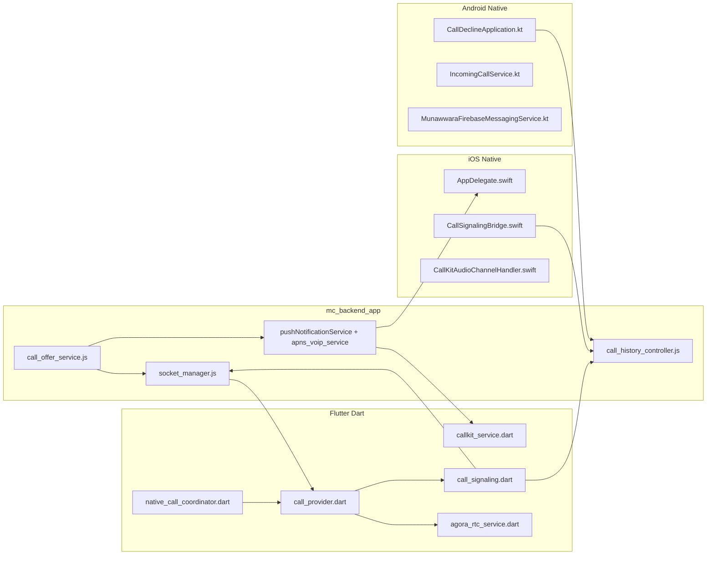
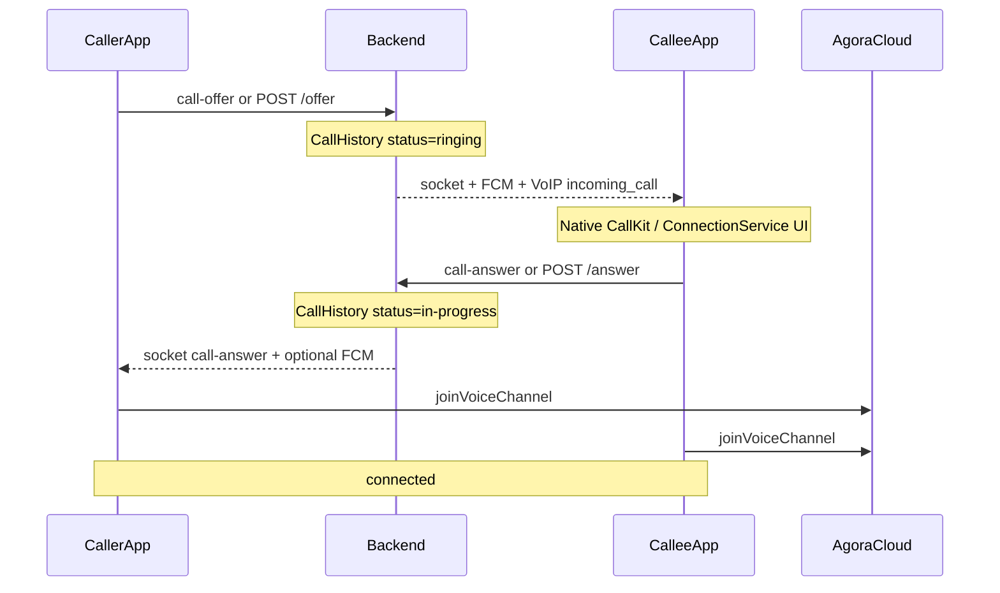
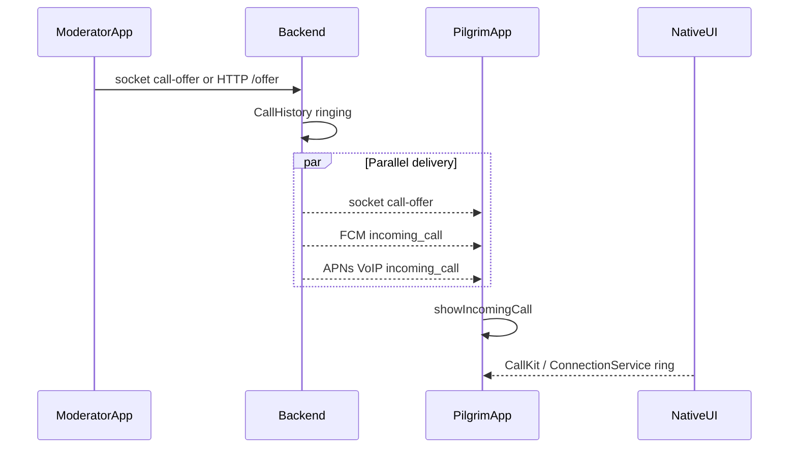
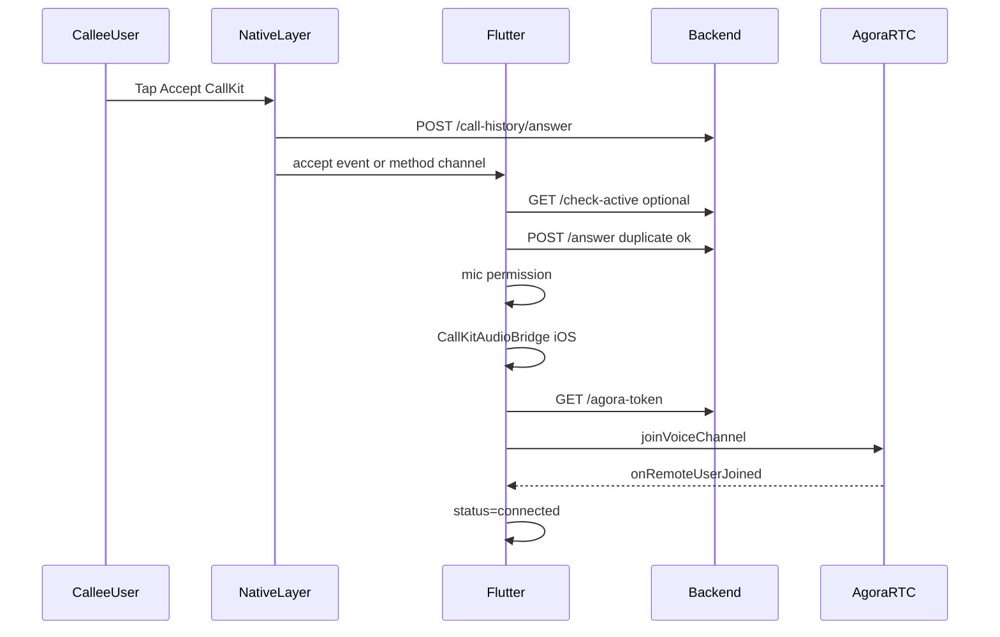
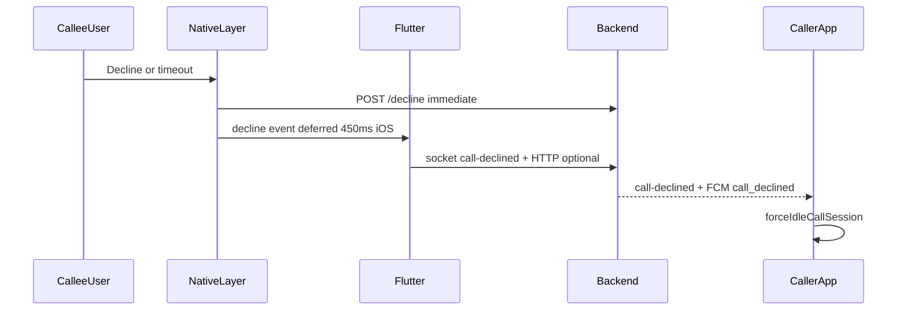
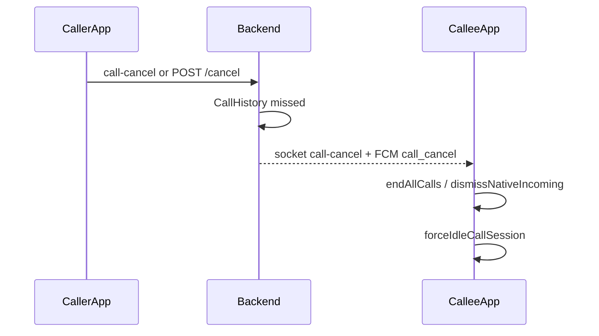
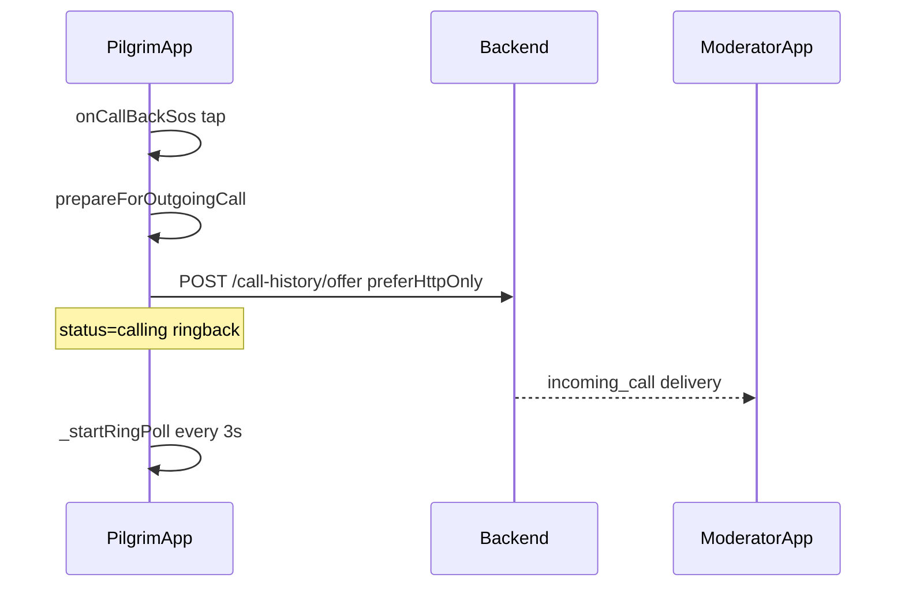
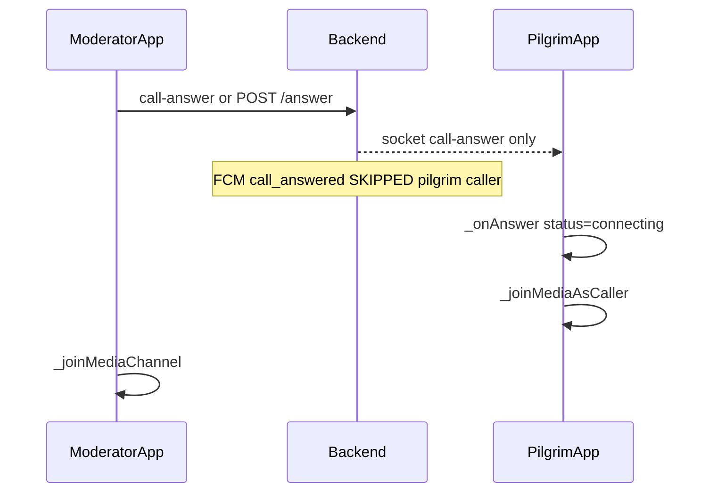
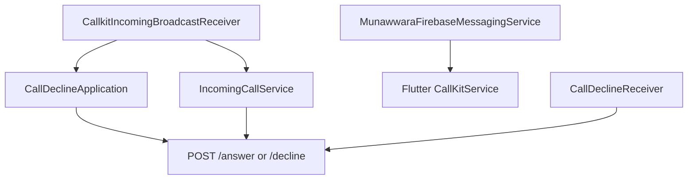

# Munawwara Care — Voice Calls Complete Flow (A→Z)

> **Purpose:** Master reference for how voice calling works end-to-end across backend, Flutter, Android native, and iOS native — in **foreground**, **background**, and **killed** app states. Written so an AI agent or engineer can reason about the system without reading source first.
>
> **Related:** [voice-calls-architecture.md](./voice-calls-architecture.md) — regression guards, historical bugs, and “do not touch” safeguards.  
> **PushKit checklist:** [pushkit_doc.md](./pushkit_doc.md)
>
> **Last aligned with codebase:** June 2026 (lock-screen CallKit hangup fix, `CallSignalingBridge.postEnd`, connected ghost reconcile).

---

## Table of contents

0. [Glossary](#0-glossary)
1. [System overview](#1-system-overview)
2. [Client call state machine](#2-client-call-state-machine)
3. [Backend reference](#3-backend-reference)
4. [Persistence and recovery keys](#4-persistence-and-recovery-keys)
5. [App bootstrap order](#5-app-bootstrap-order)
6. [Scenario flows](#6-scenario-flows)
7. [Platform-native layers](#7-platform-native-layers)
8. [Android vs iOS comparison matrix](#8-android-vs-ios-comparison-matrix)
9. [Dedup and race-condition catalog](#9-dedup-and-race-condition-catalog)
10. [Known platform gaps](#10-known-platform-gaps)
11. [File index](#11-file-index)
12. [Test matrix checklist](#12-test-matrix-checklist)

---

## 0. Glossary

| Term | Meaning |
|------|---------|
| **Caller** | User who initiated the call (`CallHistory.caller_id`). |
| **Callee** | User receiving the ring (`CallHistory.receiver_id`). |
| **Pilgrim** | End-user role (`user_type: pilgrim`). Incoming moderator calls show **support branding** in UI. |
| **Moderator** | Staff role. Can call pilgrims; receives SOS callback rings. |
| **Signaling** | Offer, ring, accept, decline, cancel — Socket.IO + REST + FCM + APNs VoIP. Does **not** carry voice. |
| **Media** | Agora RTC voice channel. Both parties fetch a token and join the same `channelName`. |
| **Foreground** | App visible and Dart isolate running. |
| **Background** | App not visible; process may be alive (suspended on iOS). |
| **Killed** | Process not running; wake via FCM (Android) or PushKit VoIP (iOS). |

---

## 1. System overview

Voice calling uses a **dual-layer model**:

1. **Signaling layer** — coordinates who is ringing whom, accept/decline/cancel, and DB state (`CallHistory`).
2. **Media layer** — Agora RTC after both sides know the `channelName` and have joined.



### High-level happy path (1:1 call)



---

## 2. Client call state machine

**Source:** `Munawwara_Care_Flutter/lib/features/calling/providers/call_provider.dart`

### `CallStatus` enum

```
idle → calling | ringing → connecting → connected → ended → idle
```

| Status | Meaning | `isInCall` |
|--------|---------|------------|
| `idle` | No active call | false |
| `calling` | Outgoing ring (caller waiting for answer) | true |
| `ringing` | Incoming ring (callee deciding) | true |
| `connecting` | Answer received; Agora join in progress | true |
| `connected` | Media up; duration timer running | true |
| `ended` | Teardown; 10s cooldown before `idle` | false |

### Important `CallState` fields

| Field | Role |
|-------|------|
| `remoteUserId` / `remoteUserName` | Peer identity for signaling and UI |
| `displayPeerAsSupportBranding` | Pilgrim sees “support” label for moderator calls |
| `isGroupRingingOut` | SOS group ring to multiple moderators |
| `cooldownSeconds` | Post-call lockout (default 10s) |

### Idempotency and race guards

| Guard | Location | Purpose |
|-------|----------|---------|
| `_acceptInProgress` | `call_provider.dart` | Prevents duplicate accept → double Agora join |
| `_navigatingToCall` | `native_call_coordinator.dart` | Prevents duplicate `VoiceCallScreen` pushes |
| `bypassNavigatingGuard` | `call_navigation.dart` | Coordinator bypasses its own navigation lock |
| 450ms decline grace | `call_provider._scheduleDecline` | iOS CallKit can emit end before accept |
| 5s outgoing CallKit grace | `shouldIgnoreStaleCallKitTeardown` | Ignore stale CallKit end after new SOS callback |
| 5s stale FCM grace | `shouldIgnoreStaleCallControlFcm` | Ignore old `call_declined` during new outgoing ring |
| Ring dedup | `callkit_service.dart` + Android `claimIncomingRing` | Socket + FCM double delivery |

---

## 3. Backend reference

**Base path:** `/api/call-history` (mounted in `mc_backend_app/index.js`)

### 3.1 REST API

**Routes:** `mc_backend_app/routes/call_history_routes.js`  
**Handlers:** `mc_backend_app/controllers/call_history_controller.js`

| Method | Route | Auth | Request | Response / effect |
|--------|-------|------|---------|-------------------|
| `POST` | `/offer` | yes (`protect`) | `{ to, channelName }` | `{ success, callRecordId }`; creates `ringing` row |
| `GET` | `/check-active` | **no** | `?callerId=&callRecordId=` (record optional) | `{ active, status, callRecordId }`; sweeps rows older than 5 min |
| `POST` | `/answer` | **no** | `{ callerId, answererId? }` | `{ success }`; emits socket `call-answer`; FCM backup |
| `POST` | `/decline` | **no** | `{ callerId?, declinerId?, callRecordId?, noAnswer? }` | `{ success }` or `{ ignored: true }` |
| `POST` | `/cancel` | **no** | `{ callerId, receiverId?, callRecordId?, groupCancel? }` | Cancels ringing; notifies callee(s) |
| `POST` | `/end` | **no** | `{ peerId, enderId?, callRecordId?, quiet? }` | Ends `ringing`/`in-progress` row; emits socket `call-end`; FCM `call_ended` unless `quiet: true` |
| `GET` | `/agora-token` | yes | `?channelName=` | `{ token, uid, appId, channelName, tokenRequired }` |

**`check-active` semantics:** Finds latest `CallHistory` where `caller_id = callerId` and `status ∈ {ringing, in-progress}`. If `callRecordId` query provided, `active` is true only when IDs match.

### 3.2 Socket events

**Source:** `mc_backend_app/sockets/socket_manager.js`  
Socket rooms: `user_{userId}` (joined on `register-user`).

#### Client → server

| Event | Payload | Handler |
|-------|---------|---------|
| `call-offer` | `{ to, channelName }` | `placeCallOffer()` |
| `call-offer-group` | `{ channelName, targets[] }` | SOS parallel ring |
| `call-answer` | `{ to }` | `to` = **caller** userId |
| `call-declined` | `{ to, noAnswer? }` | `to` = **caller** userId |
| `call-cancel` | `{ to }` | `to` = **receiver** userId |
| `call-busy` | `{ to }` | Callee busy → relay to caller |
| `call-end` | `{ to }` | End in-progress call |
| `group-call-cancel` | (none) | Cancel group SOS ring |

#### Server → client

| Event | Payload |
|-------|---------|
| `call-offer` | `{ channelName, from, callerInfo, callRecordId }` |
| `call-answer` | `{ from }` — answerer userId |
| `call-declined` | `{ from }` — decliner userId |
| `call-cancel` | `{ from, callRecordId? }` |
| `call-busy` | `{ from }` |
| `call-end` | `{ from }` |

**`callerInfo` shape:** `{ id, name, role, gender, profile_picture }`

### 3.3 Push payloads

#### FCM data messages (`call_offer_service.js`, `call_decline_service.js`)

All call-control FCM uses `isUrgent: true` (high priority, data-only control — not shown as chat notifications in app logic).

**`incoming_call`** (to callee):

```json
{
  "type": "incoming_call",
  "callerId": "<string>",
  "callerName": "<string>",
  "callerRole": "<string>",
  "channelName": "<string>",
  "callRecordId": "<string>",
  "callerGender": "<optional>",
  "callerProfilePicture": "<optional>",
  "displayName": "Munawwara Care"
}
```

`displayName` and title `"Munawwara Care"` are added when callee is a **pilgrim**.

**`call_answered`** (to caller — **moderators only**):

```json
{
  "type": "call_answered",
  "callerId": "<answererId>",
  "callRecordId": "<optional>"
}
```

**Skipped when caller `user_type === 'pilgrim'`** — pilgrim outgoing callback must get answer via **socket only**.

**`call_declined`** (to caller):

```json
{
  "type": "call_declined",
  "callerId": "<declinerId>",
  "callRecordId": "<optional>"
}
```

**`call_cancel`** (to callee):

```json
{
  "type": "call_cancel",
  "callerId": "<originalCallerId>",
  "callRecordId": "<optional>"
}
```

**`call_ended`** (to peer — **moderators only**; skipped for pilgrim peers):

```json
{
  "type": "call_ended",
  "callerId": "<enderId>"
}
```

#### APNs VoIP (PushKit) — iOS only

**Source:** `mc_backend_app/services/apns_voip_service.js`

Payload (same logical fields as FCM `incoming_call`):

```json
{
  "type": "incoming_call",
  "callerId": "...",
  "callerName": "...",
  "callerRole": "...",
  "channelName": "...",
  "callRecordId": "...",
  "callerGender": "...",
  "callerProfilePicture": "...",
  "displayName": "Munawwara Care"
}
```

Sent in **parallel** with socket and FCM when recipient has `apns_voip_token`.

### 3.4 CallHistory lifecycle

**Model:** `mc_backend_app/models/call_history_model.js`

```
ringing → in-progress → completed   (normal answer + hangup)
ringing → declined                  (explicit decline)
ringing → missed                    (timeout, cancel, noAnswer)
ringing | in-progress → ended       (stale cleanup in check-active)
```

**Server ring timeout:** 45 seconds (`RING_TIMEOUT_MS` in `ring_timeout_recovery.js` and `socket_manager.js`).

**Offer placement:** `mc_backend_app/services/call_offer_service.js` → `placeCallOffer()` → `deliverIncomingCallToRecipient()`.

---

## 4. Persistence and recovery keys

Native HTTP (killed accept/decline) reads Flutter SharedPreferences / iOS UserDefaults with prefix **`flutter.`**.

### SharedPreferences / UserDefaults keys

| Key | Written by | Used for |
|-----|------------|----------|
| `pending_call_caller_id` | `CallKitService._savePendingIncomingCall`, iOS `persistPendingCall` | Native HTTP callerId |
| `pending_call_record_id` | same | Decline/verify by record |
| `pending_call_channel_name` | same | Agora channel recovery |
| `pending_call_caller_name` | same | UI / accept recovery |
| `pending_call_caller_role` | same | Accept recovery |
| `pending_call_caller_gender` | same | UI |
| `pending_call_caller_profile_picture` | same | UI |
| `pending_call_created_at_ms` | same | Stale ring detection |
| `pending_call_uuid` | same | CallKit id |
| `api_base_url` | `ApiService.cacheNativeBridgePrefs` | Native HTTP base URL |
| `user_id` | `SecureSessionStore.syncNativeMirrorPrefs` | `answererId` / `declinerId` |
| `pending_outgoing_stop_reason` | `CallKitService.persistPendingOutgoingStop` | Caller learns callee declined while waking |
| `last_incoming_call_ring_claim` | `CallKitService` dedup | Cross-isolate ring dedup |
| `last_call_cancel_ms` / `last_cancel_caller_id` | `CallDismissHelper` | Stale cancel guard (Android) |
| `outgoing_call_receiver_id` / `outgoing_call_is_group` | `call_provider._persistOutgoingCall` | Outgoing reconcile after death |

### JSON recovery file (iOS + Dart)

**Path:** `{ApplicationDocumentsDirectory}/pending_call_accept.json`

```json
{
  "callerId": "<string>",
  "callerName": "<string>",
  "channelName": "<string>",
  "callerRole": "<string>"
}
```

| Writer | When |
|--------|------|
| `CallSignalingBridge.persistPendingAccept` | iOS native accept (`AppDelegate.onAccept`) |
| `NativeCallCoordinator._persistPendingAcceptToFile` | Dart accept processing |

| Clearer | When |
|---------|------|
| `CallSignalingBridge.clearPendingAcceptFile` | Successful native decline HTTP |
| `NativeCallCoordinator.clearPendingAcceptFileAfterAnswer` | Dart `acceptCall` after answer HTTP |
| `NativeCallCoordinator.discardPendingAcceptRecovery` | Stale accept, new outgoing call, ghost reconcile |

### Native HTTP endpoints (both platforms)

| Action | Method | URL |
|--------|--------|-----|
| Accept | `POST` | `{apiBaseUrl}/call-history/answer` |
| Decline | `POST` | `{apiBaseUrl}/call-history/decline` |
| Check active | `GET` | `{apiBaseUrl}/call-history/check-active?callerId=` |

**Fallback API URL (iOS):** `https://mc-backend-44890250266.europe-west3.run.app/api`  
**Fallback API URL (Android):** `BuildConfig.API_BASE_URL` via `BackendConfig.kt`

---

## 5. App bootstrap order

### Phase 1 — Before `runApp` (`main.dart`)

1. `WidgetsFlutterBinding.ensureInitialized()`
2. `CallingScope.riverpod = container`
3. `NativeCallCoordinator.registerEarlyListeners()` — CallKit event channel
4. `CallKitAudioBridge.registerEarly()` — iOS method channel + `recoverMissedCallKitActivation`
5. `CallKitAudioBridge.onNativeCallAccepted` → `handleNativeCallAccepted`
6. `CallKitAudioBridge.onNativeCallDeclined` → `handleNativeCallDeclined`
7. `prepareCoreRuntime()` — auth migrate, `SecureSessionStore.syncNativeMirrorPrefs`
8. `FirebaseMessaging.onBackgroundMessage(firebaseMessagingBackgroundHandler)`
9. `runApp(...)`

### Phase 2 — After login / dashboard (`mobile_messaging_bootstrap.dart`)

`bindMobileMessagingServices()`:

1. `NotificationService.ensureInitialized()`
2. FCM token lifecycle
3. Foreground FCM → `NativeCallCoordinator.handleForegroundCallControl` / `CallKitService.handleFcmMessage`
4. **`NativeCallCoordinator.recoverAcceptedCallOnStartup()`**
5. iOS VoIP token upload (`bindIosVoipTokenLifecycle`)

### Phase 3 — Dashboard socket ready

`pilgrim_dashboard_screen.dart` / `moderator_dashboard_screen.dart` → `_reconcileCallsAfterSocketReady()`:

1. `CallKitService.recoverStaleIncomingCallGuards()`
2. `callProvider.reconcileCallStateAfterProcessDeath()`
3. `checkPendingAcceptedCall()`
4. `checkPendingDeclinedCall()`

### Phase 4 — App resume (`main.dart` `didChangeAppLifecycleState`)

On `resumed`: `callProvider.reconcileCallStateAfterProcessDeath()`

---

## 6. Scenario flows

Each scenario lists **who initiates**, a sequence diagram, per-state behavior, and numbered file trace.

---

### Scenario A: Moderator calls Pilgrim (incoming to pilgrim)

**Initiator:** Moderator (caller)  
**Callee:** Pilgrim



#### Per app state (pilgrim device)

| State | Ring path | Dart state |
|-------|-----------|------------|
| **Foreground** | Socket `call-offer` → `_handleIncomingOffer` → `showIncomingCall` | `ringing` immediately |
| **Background** | FCM `incoming_call` → `handleFcmMessage` → `showIncomingCall(skipServerVerify: true)` | Ring UI; Dart may be suspended |
| **Killed (Android)** | FCM → `firebaseMessagingBackgroundHandler` → plugin UI + `IncomingCallService` | Process cold-start on user action |
| **Killed (iOS)** | PushKit → `AppDelegate.pushRegistry:didReceiveIncomingPushWith` → `persistPendingCall` → `showCallkitIncoming(fromPushKit: true)` | No Dart until accept/decline |

#### Numbered trace (server → pilgrim ring)

1. `call_provider.startCall` (moderator) or socket handler → `CallSignaling.placeOutgoingOffer`
2. `call_offer_service.placeCallOffer` → DB row + `attachCallerRingTimeout(45s)`
3. `deliverIncomingCallToRecipient` → socket + FCM + VoIP parallel
4. Pilgrim: `_onIncomingOffer` / FCM → `CallKitService.showIncomingCall`
5. Dedup: `_inFlightRingClaim`, `last_incoming_call_ring_claim`, native `claimIncomingRing` (Android)
6. `_savePendingIncomingCall` → SharedPreferences
7. `FlutterCallkitIncoming.showCallkitIncoming`
8. iOS: `_startIosCallKitRingPoll` while `ringing`

**Key files:**

- Backend: `services/call_offer_service.js`
- Dart: `call_provider.dart`, `callkit_service.dart`
- Android: `CallkitIncomingBroadcastReceiver.kt`, `IncomingCallService.kt`
- iOS: `AppDelegate.swift`, `CallSignalingBridge.persistPendingCall`

---

### Scenario B: Callee accepts (pilgrim or moderator)

**Applies to:** Any incoming 1:1 call.



#### Per app state

| Layer | Foreground | Background | Killed |
|-------|------------|------------|--------|
| Native HTTP accept | Android/iOS fires | same | **Required** — Dart may not run |
| Dart accept fn | `acceptCall()` | `acceptCallFromFcm` / events | `checkPendingAcceptedCall` after boot |
| iOS audio | `ensureReadyBeforeMediaJoin` | same | `recoverMissedCallKitActivation` |
| Agora join | `_joinMediaChannel` | same after wake | same after cold start |

#### Numbered trace

1. User taps Accept on CallKit UI
2. **iOS:** `AppDelegate.onAccept` → `CallSignalingBridge.postAnswer` + `persistPendingAccept` + `CallKitAudioChannelHandler.notifyCallAccepted`
3. **Android:** `CallDeclineApplication.postAnswer` (registered at `Application.onCreate`)
4. Plugin: `Event.actionCallAccept` → `NativeCallCoordinator._handleAcceptedCall` → `_processAcceptedCall`
5. iOS bridge: `CallKitAudioBridge.onNativeCallAccepted` (same as step 4)
6. iOS poll fallback: `_startIosCallKitRingPoll` detects `isAccepted` → `acceptCallFromFcm`
7. `acceptCallFromFcm`: `verifyIncomingCallActive` → set `ringing` → `acceptCall()`
8. `acceptCall`: `CallSignaling.emitWhenConnected('call-answer')` + `notifyAnswerHttp` (duplicate of native OK)
9. `CallKitAudioBridge.ensureReadyBeforeMediaJoin()` (iOS)
10. `AgoraRtcService.joinVoiceChannel` → GET `/agora-token`
11. `_onRemoteUserJoinedMedia` → `connected`, start timer
12. Android: `FlutterCallkitIncoming.setCallConnected` (iOS skips — CallKit error 4)
13. Navigate: `openVoiceCallScreen(bypassNavigatingGuard: true)`

**Key files:**

- iOS: `AppDelegate.swift`, `CallSignalingBridge.swift`, `CallKitAudioChannelHandler.swift`
- Android: `CallDeclineApplication.kt`
- Dart: `native_call_coordinator.dart`, `call_provider.dart`, `callkit_audio_bridge.dart`, `agora_rtc_service.dart`

---

### Scenario C: Callee declines or timeout



#### Per app state

| State | Native HTTP | Dart |
|-------|-------------|------|
| Foreground | Fires + Dart `declineCall` after 450ms grace | Socket + HTTP |
| Background | Android: receiver + application + service | May use BG isolate |
| Killed | **Android:** `CallDeclineReceiver` + `CallDeclineApplication` + `IncomingCallService` | **iOS:** `CallSignalingBridge.postDecline` sync in `onDecline` |

**`noAnswer: true`:** CallKit timeout → status `missed` (not `declined`).

**Key files:**

- iOS: `AppDelegate.onDecline`, `onTimeOut`, `onDeclineIncomingWithoutManagedCall`
- Android: `CallDeclineReceiver.kt`, `CallDeclineApplication.kt`, `IncomingCallService.handleDecline`
- Dart: `call_provider.declineCall`, `declineCallAsNoAnswer`, `_sendBackgroundDecline`

---

### Scenario D: Caller cancels while ringing



| Platform | Cancel delivery to callee |
|----------|---------------------------|
| Android | `MunawwaraFirebaseMessagingService` native + `CallDismissHelper` |
| iOS | Dart `CallKitService.handleFcmMessage` → `endAllCalls` |
| Poll fallback | Android `IncomingCallService` polls `check-active` every 1s |

**Caller side:** `cancelOutgoingRing()` — min 3s guard; `CallSignaling.notifyCancelHttp` + socket `call-cancel`.

---

### Scenario E: Pilgrim SOS callback → Moderator (outgoing from pilgrim)

**Initiator:** Pilgrim (caller)  
**Callee:** Moderator



#### Trace

1. `pilgrim_dashboard_screen.onCallBackSos` → `callProvider.startCall(remoteUserId: _sosCallbackModeratorId)`
2. Guards: `sosActive`, `!isInCall`, `cooldownSeconds == 0`
3. `prepareForOutgoingCall(targetPeerId: modId)`: end CallKit, `discardPendingAcceptRecovery`, cancel stale server rings; if mod still has active leg as caller, `POST /end` with **`quiet: true`** (no `call_ended` FCM race before new offer)
4. `CallSignaling.placeOutgoingOffer(preferHttpOnly: true)` → **always HTTP** (ghost socket after SOS)
5. `state = calling`, `_outgoingChannelName = call_<timestamp>`
6. `_startRingPoll`, `_startSessionWatchdog`, ringback audio
7. Moderator receives Scenario A as callee (VoIP on killed iOS)

**Callback hardening (mod killed/background):**
- **Quiet end:** stale-leg cleanup uses `quiet: true` so `call_ended` FCM does not dismiss the new VoIP ring
- **CallKit grace:** mod ignores `call_ended` FCM within 8s of showing incoming ring
- **Busy bypass:** mod `_handleIncomingOffer` force-idles same-peer callback instead of `call-busy`

**Key rule:** Never socket-only offer for pilgrim outgoing.

**Log grep (callback):** `POST /end quiet=true`, `VoIP push delivered`, **no** `call_ended FCM sent` between end and offer, no `call-busy`.

---

### Scenario F: Moderator accepts pilgrim callback



**Critical constraint:** `notifyCallerCallAnswered` in `call_decline_service.js` **skips FCM when caller is pilgrim**. Pilgrim must have **active socket** (or resume reconcile) to receive `call-answer`.

| Pilgrim state | Answer delivery |
|---------------|-----------------|
| Foreground | Socket `call-answer` → `_onAnswer` |
| Background iOS | Socket if connected; **no ring poll** (timers suspended) |
| Background Android | Socket + optional FCM if ever enabled for pilgrim (currently skipped) |

---

### Scenario G: Group SOS ring (all moderators)

1. `callProvider.startGroupModeratorCall(moderators)` → socket `call-offer-group { targets, channelName }`
2. Server rings all moderators in parallel
3. First `call-answer` → server cancels other mods via `call-cancel` + FCM
4. Same Agora `channelName` for all legs until first answer wins

---

### Scenario H: Call ends / teardown

```mermaid
sequenceDiagram
  participant User as EitherParty
  participant Dart as call_provider
  participant Server as Backend
  participant Agora as AgoraRTC

  User->>Dart: endCall or remote offline
  Dart->>Server: call-end socket + POST /call-history/end
  Note over Server: Updates CallHistory; FCM call_ended to peer
  Dart->>Agora: leaveChannel
  Dart->>Dart: forceIdleCallSession
  Note over Dart: 10s cooldown
```

| Step | Action |
|------|--------|
| 1 | `endCall()` or `_onRemoteUserOffline` |
| 2 | Capture `remoteId`, `callRecordId`, `myId` **before** teardown |
| 3 | `CallSignaling.emitWhenConnected('call-end', {to})` |
| 4 | `CallSignaling.notifyEndHttp({ peerId, enderId, callRecordId })` — REST fallback when socket is down; callee hang-up always hits HTTP so DB + mod FCM reconcile |
| 5 | `forceIdleCallSession` → `AgoraRtcService.leaveChannel` |
| 6 | `CallKitService.endAllCalls` / `clearLocalCallTracking` |
| 7 | Android: `resetCallAudio` MethodChannel |
| 8 | iOS: `CallKitAudioBridge.reset()` |
| 9 | `state = ended` → 10s cooldown → `idle` |

**Moderator FCM reconcile:** `_reconcilePendingOutgoingStopFromFcm` tears down when status is `calling`, `ringing`, `connecting`, or `connected` (not only pre-connect).

**SOS callback prep:** `prepareForOutgoingCall(targetPeerId: modId)` calls `check-active?callerId={modId}` and `POST /end quiet=true` if the prior mod→pilgrim leg is still `in-progress`.

**Log grep (GCP):** `POST /end quiet=true`, `VoIP push delivered`, no `call_ended FCM sent` between callback end and offer, no `call-busy` after `POST /offer`.

**`PopScope` on `VoiceCallScreen`:** back gesture blocked until `ended` or `idle`.

### Scenario H2: Lock-screen CallKit hangup (iOS) — ghost call fix

**Repro:** App foreground → screen off (locked) → incoming call → answer on CallKit → talk → tap **End** on native CallKit UI while locked.

**Previous bug:** Dart ignored `actionCallEnded` when `connected`; `AppDelegate.onEnd` was a no-op → no `POST /end`, caller still in-call, callee re-opens app still `connected`, audio resumes.

**Fix (current):**

| Layer | Behavior |
|-------|----------|
| `AppDelegate.onEnd` | `CallSignalingBridge.postEnd` + `CallKitAudioChannelHandler.notifyCallEnded` |
| `CallSignalingBridge.postEnd` | `POST /call-history/end` with `{ peerId, enderId, callRecordId }` even when Dart is suspended |
| `native_call_coordinator` | `actionCallEnded` only ignored during **accept grace** (~3s, `connecting` only) — **not** when `connected` |
| `handleNativeCallEnded` | Dart idempotent `endCall()` when bridge fires |
| `_reconcileGhostInCallState` | Includes `connected`; `check-active` on resume self-heals |

**Log grep:** `[CallSignaling] Native END ->`, must **not** see `Ignoring CallKit ended during accept/active call` on user hangup (only `Ignoring spurious CallKit end` within accept grace).

**Related:** [pushkit_doc.md](./pushkit_doc.md)

---

## 7. Platform-native layers

### 7.1 Android

**Package:** `com.munawwaracare.android`  
**Path:** `Munawwara_Care_Flutter/android/app/src/main/kotlin/com/munawwaracare/android/`

| Component | File | Role |
|-----------|------|------|
| Application hook | `CallDeclineApplication.kt` | `CallkitEventCallback` → `postAnswer` / `postDecline` at process start |
| Broadcast receiver | `CallDeclineReceiver.kt` | Plugin `ACTION_CALL_DECLINE` / `ACTION_CALL_TIMEOUT` → HTTP when killed |
| Foreground service | `IncomingCallService.kt` | Core-Telecom ring, decline HTTP, `check-active` poll |
| FCM service | `MunawwaraFirebaseMessagingService.kt` | Native `call_cancel` / `call_declined` before Flutter |
| Dismiss helper | `CallDismissHelper.kt` | Plugin UI + Core-Telecom teardown |
| Audio cleanup | `CallAudioCleanup.kt` | `resetAudioMode`, clear pending prefs |
| Activity channel | `MainActivity.kt` | `stopRinging` MethodChannel |

**Manifest (`AndroidManifest.xml`):**

- `android:name=".CallDeclineApplication"`
- `MunawwaraFirebaseMessagingService`
- `IncomingCallService` (`foregroundServiceType="phoneCall"`)
- `CallDeclineReceiver` (exported) for plugin decline/timeout actions

**Background FCM isolate (`notification_service.dart`):**

- On `incoming_call`: show ring, subscribe to CallKit events up to **32 seconds**
- Decline/timeout in isolate → `_sendDeclineHttp` + `endCurrentCall`
- Accept in isolate → hide tray only; main isolate joins Agora on resume



### 7.2 iOS

**Path:** `Munawwara_Care_Flutter/ios/Runner/`

| Component | File | Role |
|-----------|------|------|
| Push + CallKit | `AppDelegate.swift` | PushKit registry, `CallkitIncomingAppDelegate` |
| Native HTTP | `CallSignalingBridge.swift` | `postAnswer`, `postDecline`, `persistPendingCall`, `persistPendingAccept` |
| Method channel | `CallKitAudioChannelHandler.swift` | `com.munawwaracare/callkit_audio` |
| Entitlements | `Runner-Release.entitlements` | `aps-environment: production` |
| Info.plist | `UIBackgroundModes` | `voip`, `remote-notification`, `audio` |

**Push registration:**

| Mechanism | Purpose |
|-----------|---------|
| PushKit `.voIP` | Killed incoming calls |
| `registerForRemoteNotifications` | FCM device token |
| `hasPushEntitlement()` | Release builds always register; Debug checks provision profile |

**CallKit delegate methods (`AppDelegate`):**

| Method | HTTP | Dart notify |
|--------|------|-------------|
| `onAccept` | `postAnswer` immediate | `notifyCallAccepted` immediate |
| `onDecline` | `postDecline` immediate | `notifyCallDeclined` **deferred 450ms** |
| `onTimeOut` | `postDecline(noAnswer: true)` | `notifyCallDeclined` immediate |
| `onDeclineIncomingWithoutManagedCall` | `postDecline(extra:)` | — |
| `onEnd` | `postEnd` immediate | `notifyCallEnded` immediate |
| `didActivateAudioSession` | — | `notifyAudioSessionActivated` |

**VoIP wake path:**

1. `pushRegistry:didReceiveIncomingPushWith`
2. `CallSignalingBridge.persistPendingCall`
3. `SwiftFlutterCallkitIncomingPlugin.showCallkitIncoming(fromPushKit: true)`

---

## 8. Android vs iOS comparison matrix

| Concern | Android | iOS |
|---------|---------|-----|
| **Killed incoming ring** | FCM → bg handler → plugin + FGS | PushKit VoIP → CallKit |
| **Killed accept HTTP** | `CallDeclineApplication.postAnswer` | `CallSignalingBridge.postAnswer` |
| **Killed decline HTTP** | Receiver + Application + Service (redundant) | `postDecline` sync in `onDecline` |
| **Accept recovery file** | None (prefs + events) | `pending_call_accept.json` |
| **CallKit audio before Agora** | N/A | `CallKitAudioBridge.ensureReadyBeforeMediaJoin` |
| **setCallConnected after join** | Yes | **No** (CallKit error 4) |
| **Native dismiss on cancel** | `CallDismissHelper` + Core-Telecom | `endAllCalls` only |
| **Outgoing ring poll (caller)** | Works in background (FGS/isolate) | **Suspended** when backgrounded |
| **BG decline isolate** | 32s keep-alive | Same handler; VoIP path primary |
| **Duplicate ring dedup** | `claimIncomingRing` + Dart | Dart dedup only |
| **API URL if prefs empty** | `BuildConfig.API_BASE_URL` | Production Cloud Run fallback |
| **Pilgrim callback answer FCM** | Skipped by server | Skipped by server |
| **Missed-call native callback** | Disabled (`isShowCallback: false`) | Disabled |

---

## 9. Dedup and race-condition catalog

| Issue | Mitigation | Files |
|-------|------------|-------|
| Socket + FCM double ring | `_inFlightRingClaim`, `last_incoming_call_ring_claim`, Android `claimIncomingRing` | `callkit_service.dart`, plugin receiver |
| Accept + decline race | 450ms `_scheduleDecline`; native iOS decline HTTP immediate | `call_provider.dart`, `AppDelegate.swift` |
| Duplicate accept | `_acceptInProgress` | `call_provider.dart` |
| Duplicate navigation | `_navigatingToCall`, `bypassNavigatingGuard` | `native_call_coordinator.dart`, `call_navigation.dart` |
| `actionCallEnded` after accept | Ignore only during accept grace (~3s, `connecting`); **end** when `connected` | `native_call_coordinator.dart` |
| Lock-screen CallKit hangup | Native `postEnd` + Dart `endCall` | `CallSignalingBridge.swift`, `AppDelegate.swift` |
| Stale `call_ended` FCM | `callRecordId` in payload; ignore when record mismatch | `call_decline_service.js`, `call_provider.dart` |
| Socket `call-end` delivery | Always `io.to(user_{peer})` room broadcast | `call_end_service.js` |
| Ghost in-call after crash | `_reconcileGhostInCallState` includes `connected` | `call_provider.dart` |
| Stale server DB rows | 5 min sweep in `check-active`; 45s ring timeout | `call_history_controller.js` |
| Wrong ring poll match | Pass `callRecordId` to `_startRingPoll` | `call_signaling.dart`, `call_provider.dart` |
| iOS false decline from poll | Require 3 empty `activeCalls` polls after saw ring | `_startIosCallKitRingPoll` |
| acceptCallFromFcm blocked own accept | Do **not** set `_acceptInProgress` before `acceptCall()` | `call_provider.dart` |
| Stale pending accept blocks callback | `discardPendingAcceptRecovery` on outgoing; server verify on startup | `native_call_coordinator.dart` |

---

## 10. Known platform gaps

Current state after iOS killed-state fixes (honest assessment):

1. **iOS outgoing ring poll** — Dart `Timer` suspended in background; caller must rely on socket or FCM for answer/decline.
2. **Pilgrim callback answer** — No FCM `call_answered` by design; socket must be up when moderator answers.
3. **Duplicate HTTP** — iOS/Android native accept/decline often followed by Dart HTTP (harmless if server idempotent).
4. **FCM-only killed incoming on iOS** — Much weaker than PushKit VoIP; VoIP cert must be correct for TestFlight.
5. **Cold-start accept latency** — Gap between CallKit accept and Agora join while app boots + socket connects.
6. **8s CallKit audio timeout** — Join proceeds with handoff fallback; rare one-way audio risk.
7. **No Android-style native dismiss on iOS** — Cancel uses `endAllCalls` rather than targeted dismiss.

---

## 11. File index

### Backend (`mc_backend_app/`)

| File | Role |
|------|------|
| `controllers/call_history_controller.js` | REST: offer, answer, decline, cancel, check-active, agora-token |
| `routes/call_history_routes.js` | Route wiring |
| `services/call_offer_service.js` | Place offer, deliver socket/FCM/VoIP |
| `services/call_decline_service.js` | FCM to caller: declined, answered, ended |
| `services/call_cancel_service.js` | Cancel outgoing, notify callee |
| `services/agora_token_service.js` | RTC token builder |
| `services/apns_voip_service.js` | PushKit VoIP pushes |
| `services/pushNotificationService.js` | FCM send helper |
| `services/ring_timeout_recovery.js` | 45s ring expiry |
| `sockets/socket_manager.js` | All `call-*` socket handlers |
| `models/call_history_model.js` | MongoDB call records |

### Flutter Dart (`Munawwara_Care_Flutter/lib/`)

| File | Role |
|------|------|
| `features/calling/providers/call_provider.dart` | State machine, Agora, polls, accept/decline/cancel |
| `features/calling/call_signaling.dart` | Socket emit + HTTP fallbacks |
| `features/calling/native_call_coordinator.dart` | CallKit events, recovery, navigation |
| `features/calling/call_navigation.dart` | `openVoiceCallScreen`, navigation guard |
| `features/calling/screens/voice_call_screen.dart` | In-call UI |
| `features/calling/calling_scope.dart` | Global Riverpod container ref |
| `core/services/callkit_service.dart` | showIncomingCall, FCM parse, prefs |
| `core/services/callkit_audio_bridge.dart` | iOS CallKit audio ↔ Agora |
| `core/services/agora_rtc_service.dart` | Token fetch, join/leave channel |
| `core/services/notification_service.dart` | FCM foreground + background handler |
| `core/bootstrap/mobile_messaging_bootstrap.dart` | FCM/VoIP bind, startup recovery |
| `features/pilgrim/screens/pilgrim_dashboard_screen.dart` | SOS callback, reconcile on socket |
| `features/moderator/screens/moderator_dashboard_screen.dart` | Same reconcile pattern |
| `main.dart` | Early listeners, lifecycle reconcile |

### Android native

| File | Role |
|------|------|
| `CallDeclineApplication.kt` | Process-start HTTP accept/decline callback |
| `CallDeclineReceiver.kt` | Killed decline/timeout HTTP |
| `IncomingCallService.kt` | Core-Telecom FGS, ring, poll, decline |
| `MunawwaraFirebaseMessagingService.kt` | Native cancel/decline FCM |
| `CallDismissHelper.kt` | Unified incoming dismiss |
| `CallAudioCleanup.kt` | Audio + prefs teardown |
| `MainActivity.kt` | `stopRinging` channel |
| `BackendConfig.kt` | API fallback URL |
| `plugins/.../CallkitIncomingBroadcastReceiver.kt` | Plugin → service bridge |

### iOS native

| File | Role |
|------|------|
| `ios/Runner/AppDelegate.swift` | PushKit, CallKit delegate |
| `ios/Runner/CallSignalingBridge.swift` | Native HTTP + persistence |
| `ios/Runner/CallKitAudioChannelHandler.swift` | Dart method channel |
| `ios/Runner/Runner-Release.entitlements` | Push production |
| `plugins/.../SwiftFlutterCallkitIncomingPlugin.swift` | CallKit provider |

---

## 12. Test matrix checklist

Use this for QA or agent verification. Check GCP/backend logs for HTTP evidence.

### Incoming: Moderator → Pilgrim

| # | App state | Action | Expected server logs | Expected client |
|---|-----------|--------|---------------------|-----------------|
| 1 | Foreground | Mod calls, pilgrim accepts | `POST /answer`, 2× `GET /agora-token` | Both `connected` |
| 2 | Background | Same | Same | CallKit accept → connecting → connected |
| 3 | Killed | Same | `POST /answer` **before** Flutter boot; then `agora-token` for pilgrim | No ghost call after end |
| 4 | Killed | Pilgrim declines | `POST /decline`; caller stops ringing | No stuck connecting |
| 5 | Foreground | Mod cancels while ringing | `POST /cancel` or socket; FCM `call_cancel` | Pilgrim idle |
| 5b | Foreground, screen off | Answer on CallKit → End on lock screen | `POST /end`, `Call record → completed` | Caller idle; callee not in-call on unlock |
| 5c | After 5b | Immediate second call | New `POST /offer` | Connects; no instant teardown |

### Outgoing: Pilgrim SOS callback → Moderator

| # | App state | Action | Expected | Expected client |
|---|-----------|--------|----------|-----------------|
| 6 | Foreground | Pilgrim taps callback, mod accepts | `POST /offer`, `POST /answer`, 2× `agora-token` | Both connected |
| 7 | Foreground | End call → tap callback again | New `POST /offer`; no blocked `isInCall` | Second call rings mod |
| 8 | Background | Pilgrim calling, mod accepts | Socket `call-answer` to pilgrim (no FCM answered) | Pilgrim joins Agora |

### Regression guards (see architecture doc)

- [ ] `bypassNavigatingGuard: true` still used in native accept navigation
- [ ] `check-active` 5-minute stale sweep active on server
- [ ] `callRecordId` passed to ring poll for outgoing calls
- [ ] `VoiceCallScreen` `PopScope` prevents back-swipe during active call
- [ ] Android Core-Telecom: `handleIncoming` idempotent; `handleAccept` releases Telecom call

### Log grep patterns (Cloud Run)

```
POST /call-history/offer
POST /call-history/answer
POST /call-history/decline
POST /call-history/end
GET /agora-token
call-answer emitted
VoIP push delivered
```

---

*End of document.*
